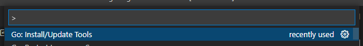
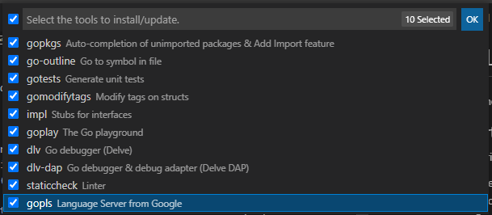

# NST GoLang Course Notebook

For writing my notes on the NST provided golang course.

## Geting started

To be able to write code with go, it needs to be installed:
- Follow the golang [install instructions](https://go.dev/doc/install)
- For VSCode, install the [go plugin](https://marketplace.visualstudio.com/items?itemName=golang.Go)
    - Once installed, dev tools need to be installed via the Command Editor (F1)  
      *Note:* Some tools require C (gcc) build tools. In linux, make sure `build-essential`is installed.
        - 
        - 

Ready to Go!

## CLI Ref

- compile pkg and deps  
    `go build <package>`
- list all pkgs in mod  
    `go list ./...`
- run pkg  
    `go sun <package>`
- clean pkg  
    `go clean`
- see package documentations  
    `go doc <package>`
- list environtment variables  
    `go env`
- format package code  
    `go fmt <mod>/<package>`
- install deps  
    `go get <source-path>`
- see go version  
    `go version`
- run linter  
    `go vet <mod>/<package>`
- cli testing  
    `go test [-short] [-v] [-run=<testname>] <mod>/<package>`
- see test coverage  
    `go test -coverageprofile=c.out <mod>/<package>`  
- see test coverage html formatted  
    `go tool cover -html=c.out`
- Benchmark function  
    `go test -bench=. <mod>/<package>`
- Benchmark function for memory  
    `go test -bench=. -benchmem <mod>/<package>`

## Course repo

https://gitlab.nearshoretc.com/elvis.sanchez/golang.git
